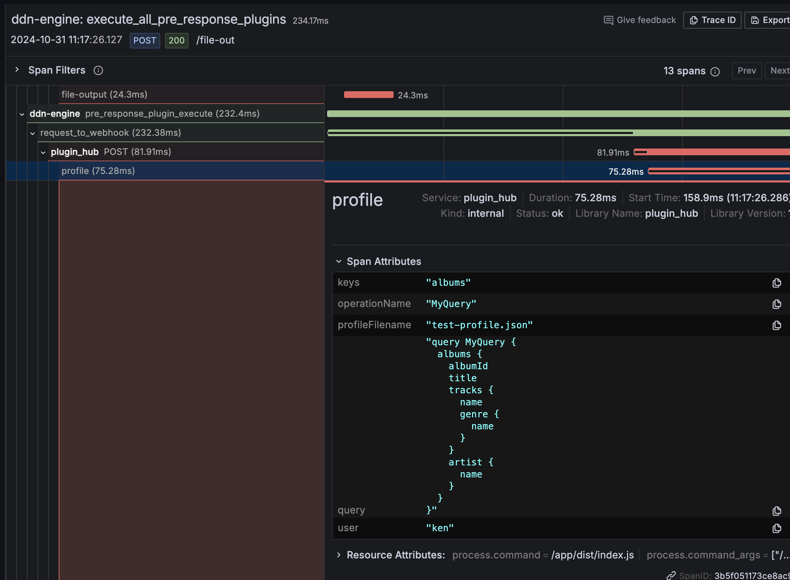

# Profile

The **POST** `/profile` endpoint provides data profiling capabilities for response data. It analyzes the response structure and writes detailed profiling reports to files.

## Headers

- `profile-filename`: Specifies the output file for the profiling report. Defaults to the query operation name + .profile.json.
- `x-hasura-user`: User identifier for tracking profiling requests
- `profile-history`: Enables historical profile tracking. Can also be set via `PROFILE_HISTORY` environment variable.

## Request Body
```json
{
  "rawRequest": GraphQLRequest,
  "session": string,
  "response": {
    "data": any
  }
}
```

## Profiling Report Structure

### Request Context
- User information
- Role information
- GraphQL query details
- Operation name
- Variables

### Data Analysis
For each field in the response, the profile may include different types of analysis based on the data type:

#### Uniqueness Analysis
- `unique`: Boolean indicating if all values are unique

#### Numerical Field Statistics
When applicable, provides detailed statistics including:
- Basic metrics:
  - Mean
  - Minimum
  - Maximum
  - Average
  - Median
  - Mode
  - Sum
- Statistical measures:
  - Variance
  - Standard deviation

#### Distribution Analysis
For numerical fields:
- Quartiles (25th, 50th, 75th percentiles)
- Deciles (10th through 90th percentiles in steps of 10)

#### Categorical Field Analysis
For fields with text or categorical data:
- `top50Counts`: Frequency distribution of the top 50 values
  - Shows value-count pairs
  - Sorted by frequency in descending order

#### DateTime Field Analysis
For date and timestamp fields:
- Temporal distribution counts:
  - `year`: Frequency of values by year
  - `month`: Distribution across months (1-12)
  - `dayOfWeek`: Distribution across days of the week
  - `dayOfMonth`: Distribution across days of the month (1-31)
  - `hourOfDay`: Distribution across hours (0-23)
- DateTime statistics:
  - Mean date/time
  - Earliest (min) date/time
  - Latest (max) date/time
  - Median date/time
  - Mode (most frequent) date/time
  - Variance and standard deviation in time differences

### Nested Fields
- Supports profiling of nested object structures
- Uses dot notation for nested field names (e.g., `artist.name`)
- Each nested field receives appropriate analysis based on its data type

### Multi-Entity Analysis
- Handles multiple top-level entities in the same query
- Each entity (e.g., 'albums', 'employees') gets its own profile section
- Maintains separate statistics and analysis for each entity's fields

## Output Types

### Traces
- Creates OpenTelemetry spans under "schema-validate"
- Tracks profiling duration and errors
- Includes additional span attributes:
  - user
  - query
  - operationName
  - profileFilename
  - data keys

### Logs
When errors occur:
- Error details logged through configured logger
- Includes request context and error information

### Files
When `profile-filename` is provided:
- Writes profiling report as JSON file
- Contains complete request context and profiling results
- Includes user and session context

### Historical Profiles
When `profile-history` header is enabled or `PROFILE_HISTORY` environment variable is set:
- Creates a directory using MD5 hash of the query
- Stores each profile execution as a separate file with UUID filename
- Maintains historical record of all profile executions for the same query

## Processing
- Main response returns immediately with status "ok"
- Profile processing occurs asynchronously using `setImmediate`
- Skips processing for introspection queries
- Skips processing if no data or profile filename is provided

## Response Format
- Success: `{"status": "ok"}`
- Error: Error details with request context

## Examples

### Query

```graphql
query MyQuery {
  albums {
    albumId
    title
    tracks {
      name
      genre {
        name
      }
    }
    artist {
      name
    }
  }
}
```

### Headers

#### profile-filename

```text
test-profile.json
```

### Outputs

#### file output

[test-profile.json](../../../docs/test-profile.json)

#### trace

