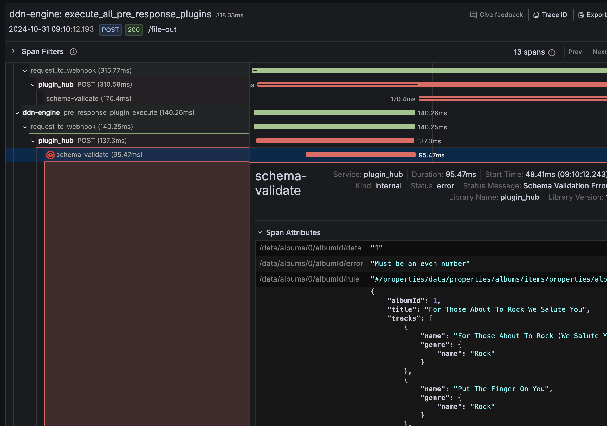

# Response Validator

The **POST** `/validate` endpoint provides JSON Schema validation for response data. It supports custom validation
options, error reporting (through files and/or persisting to a database), and telemetry integration.

## Why?

Consumers of a DDN endpoint are compositing,
selecting and filtering data. A composited
dataset that is defined for a specific purpose,
may have different data quality requirements than
the source datasets. This service provides a
consistent way to define consumer data
quality rules and provide shared evidence in a
consistent format so that data producers, support agents,
and consumers can have meaningful, fact-based discussions on 
data quality issues.

## Using Hasura PromptQL with data validations

To use PromptQL with data validation results you must persist the data validation results to a database and add that database to your supergraph.

1. You must use a database that is supported by [TypeORM](https://typeorm.io/). By default, its setup to use a local Postgres instance but you can manage this by altering your .env file . The easiest way to create a local PG instance for testing is to use docker and issue this command:

```
docker run -d -p 5432:5432 -e POSTGRES_PASSWORD=password -e POSTGRES_USER=postgres -e POSTGRES_DB=postgres postgres
```
2. As an alternative to the default postgres implementation, you can add a `.env` file and this env variables:

```dotenv
    DB_TYPE=postgress
    DB_HOST=localhost
    DB_PORT=5432
    DB_USER=<postgres>
    DB_PASSWORD=<password>
    DB_SCHEMA=data_quality
    DB_NAME=postgres
```

If you have a more custom setup, you can alter the source `src/plugins/validate/db/data-source.ts`.

3. Add the db schema, by running: `./migrate_db.sh`
4. If you have modified the `DB_*` env variables - you will need to add those to the plugin hubs `compose.yaml`.

## Headers

- `json-schema`: JSON Schema definition to validate response data against
- `validate-options`: Comma-separated validation flags:
    - `verbose`: Enable detailed error messages
    - `allerrors`: Return all validation errors instead of stopping at first
    - `strict`: Enable strict validation mode
    - `log`: Enable error logging
    - `db`: Enable db logging
- `x-hasura-user`: User identifier for tracking validation requests
- `max-validate-errors`: Maximum number of validation errors to return (default: 10)
- `validate-filename`: Writes validation report to file, defaults to query's operation name

## Request Body

```json
{
  "rawRequest": GraphQLRequest,
  "session": string,
  "response": {
    "data": any
  }
}
```

## Output Types

### Traces

- Creates OpenTelemetry spans under "schema-validate"
- Tracks validation duration and errors

### Logs

When logging is enabled:

- Error details logged through configured logger
- Includes schema violations and validation context

### Files

When `validate-filename` is provided:

- Writes validation report to specified file
- Contains schema, options, request details and errors
- Includes user and session context

## Response Format

- Success: `{"status": "ok"}`
- Validation Failure: Array of validation errors with details

## Examples

### Query

```graphql
query MyQuery {
    albums {
        albumId
        title
        tracks {
            name
            genre {
                name
            }
        }
        artist {
            name
        }
    }
}
```

### Headers

#### max-validate-errors

```text
20
```

#### validate-options

```text
allErrors,strict,verbose,log,db
```

#### validate-filename

```text
test.json
```

#### json-schema

To add as a header within the console its easiest to escape double quotes, and remove CRs.

```json
{
  "$schema": "http://json-schema.org/draft-07/schema#",
  "type": "object",
  "required": [
    "data"
  ],
  "properties": {
    "data": {
      "type": "object",
      "required": [
        "albums"
      ],
      "properties": {
        "albums": {
          "type": "array",
          "items": {
            "type": "object",
            "required": [
              "albumId",
              "artistId",
              "title",
              "artist"
            ],
            "properties": {
              "albumId": {
                "type": "integer",
                "minimum": 1,
                "multipleOf": 2,
                "description": "Must be an even number"
              },
              "artistId": {
                "type": "integer",
                "minimum": 1
              },
              "title": {
                "type": "string",
                "minLength": 1
              },
              "artist": {
                "type": "object",
                "required": [
                  "name"
                ],
                "properties": {
                  "name": {
                    "type": "string",
                    "minLength": 1
                  }
                },
                "additionalProperties": false
              }
            },
            "additionalProperties": false
          }
        }
      },
      "additionalProperties": false
    }
  },
  "additionalProperties": false
}
```

### Outputs

#### file output

[myquery.json](../../../docs/myquery.json)

#### log

[error.log](../../../docs/error.log)

#### trace

